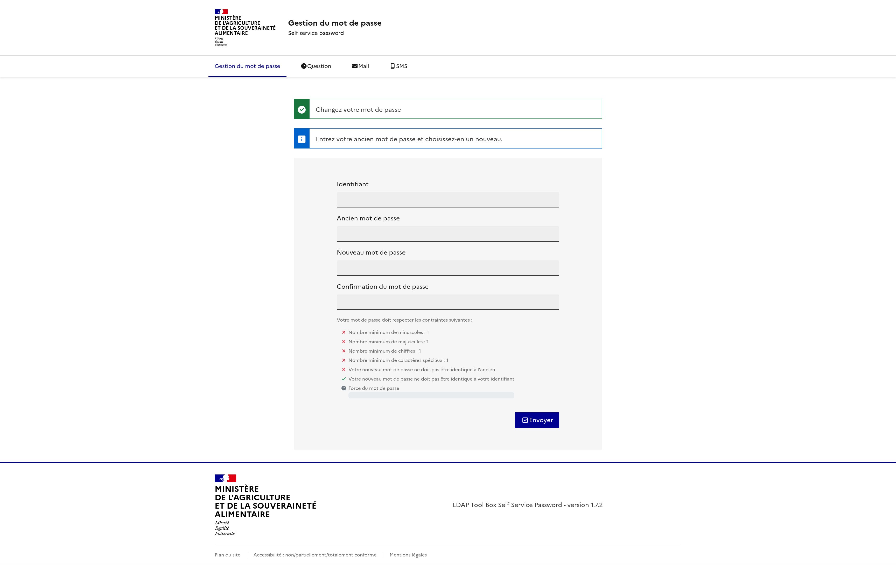

# DSFR theme for Self Service Password

This is a graphical theme for [Self Service Password](https://github.com/ltb-project/self-service-password).

[DSFR](https://github.com/GouvernementFR/dsfr) is provided by French Governement.



## Installation

### Self Service Password

Deploy Self Service Password on your server.

Minimal version required: **1.8** (or 1.7 with [patch for customized template](https://github.com/ltb-project/self-service-password/pull/1051))

### DSFR framework

The needed files can be installed form [the official git repository](https://github.com/GouvernementFR/dsfr).

Copy them to `htdocs/vendor/dsfr` in the Self Service Password installation directory.

### DSFR theme

Copy these files into the Self Service Password installation directory:
* `templates/dsfr/*`: all overriden template files
* `htdocs/css/dsfr/dsfr.css`: custom CSS file
* `htdocs/js/dsfr/*`: custom JS files

## Theme configuration

In your `config.inc.local.php` adjust these settings:
```php
$custom_tpl_dir = "templates/dsfr";
$background_image = "";
$custom_css = "css/dsfr/dsfr.css";

# To have a dropdown menu for all reset methods
$tpl_dsfr_drop_down_menu = true;

# Links
$tpl_dsfr_footer_content_links = array(
    array( "id" => "infogouv", "url" => "https://info.gouv.fr"),
    array( "id" => "servicepublic", "url" => "https://service-public.fr"),
    array( "id" => "legifrance", "url" => "https://legifrance.gouv.fr"),
    array( "id" => "datagouv", "url" => "https://data.gouv.fr"),
);

$tpl_dsfr_footer_bottom_links = array(
    array( "id" => "accessibilite", "url" => "#"),
    array( "id" => "aide", "url" => "# "),
    array( "id" => "codesrh", "url" => "# "),
    array( "id" => "mentionslegales", "url" => "# "),
    array( "id" => "politiquecookies", "url" => "# "),
);
```

Configure some messages:
```php
$messages['dsfr_entity_name'] = "Ministère<br>...<br>...";
$messages['dsfr_site_name'] = "Annuaire interne du Ministère";

# Menu dropdown
$messages['dsfr_drop_down_menu_title'] = "Réinitialisation du mot de passe";

# Question select
$messages['dsfr_placeholder_question'] = "Sélectionner une option";

# Links
$messages["dsfr_footer_link_infogouv"] = "info.gouv.fr";
$messages["dsfr_footer_link_servicepublic"] = "service-public.fr";
$messages["dsfr_footer_link_legifrance"] = "legifrance.gouv.fr";
$messages["dsfr_footer_link_datagouv"] = "data.gouv.fr";

$messages["dsfr_footer_link_accessibilite"] = "Accessibilité : non/partiellement/totalement conforme";
$messages["dsfr_footer_link_aide"] = "Aide en ligne";
$messages["dsfr_footer_link_codesrh"] = "Note sur les codes RH secondaires";
$messages["dsfr_footer_link_mentionslegales"] = "Mentions légales";
$messages["dsfr_footer_link_politiquecookies"] = "Politique des cookies";
```

## Development

To test the theme from current git repository, you will need:
* Docker image of Self Service Password
* The DSFR framework file
* A local SSP configuration file with at least theme configuration described above

You can then run the Docker image with local volumes:
```
docker run -p 8080:80 \
  -v /path/to/conf/config.local.inc.php:/var/www/conf/config.inc.local.php \
  -v /path/to/dsfr/dist:/var/www/htdocs/vendor/dsfr \
  -v $PWD/templates/dsfr:/var/www/templates/dsfr \
  -v $PWD/htdocs/css/dsfr:/var/www/htdocs/css/dsfr \
  -v $PWD/htdocs/js/dsfr:/var/www/htdocs/js/dsfr \
  -it docker.io/ltbproject/self-service-password:latest
```

Then connect on [http://localhost:8080](http://localhost:8080)
